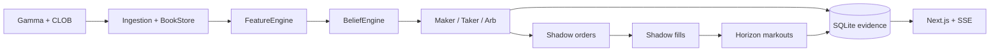

# PolySignal

[Explore the interactive research website](https://skishore23.github.io/polysignal/) · [Download the offline research plugin](https://skishore23.github.io/polysignal/polysignal-research.zip)

PolySignal is an evidence-first Polymarket market-microstructure research system. It ingests public order-book data, computes deterministic features, evaluates fee-aware maker, taker, and structural-arbitrage decisions, simulates execution, and measures subsequent outcomes.

> **Current safety boundary:** the checked-in worker is hard-wired to paper execution. Supplying trading credentials does not enable live order routing.

This is experimental research software, not financial advice. It is not affiliated with or endorsed by Polymarket.

## What it does

- Discovers active markets through the Gamma API.
- Maintains L2 books from CLOB REST snapshots and WebSocket deltas.
- Computes spread, depth, order-book imbalance, microprice, returns, acceleration, skew, entropy, volatility, and staleness.
- Blends microstructure and optional sportsbook priors into a confidence-weighted probability.
- Evaluates maker, taker, and binary/negRisk arb opportunities after canonical fees and execution costs.
- Applies wallet, inventory, toxicity, trade-flow, and Markov-regime gates.
- Simulates monotonic order lifecycles, partial fills, and horizon markouts.
- Persists the complete decision-to-outcome chain in SQLite.
- Serves a Next.js dashboard and SSE streams for performance, wallets, regimes, and evidence.
- Produces reproducible promotion, replay, and profitability artifacts under `reports/`.

## Architecture



The canonical architecture—including formulas, data contracts, state machines, failure behavior, and extension rules—is documented in [docs/architecture.md](docs/architecture.md).
The tested economic scope and unresolved historical/settlement assumptions are in [docs/math_assurance.md](docs/math_assurance.md).

## Requirements

- Node.js 20
- pnpm 9
- Python 3.11 for the independent math oracle
- macOS or Linux

The repository pins pnpm through the `packageManager` field and provides `.nvmrc` for Node.

## Quick start

```bash
git clone https://github.com/skishore23/polysignal.git
cd polysignal
corepack enable
pnpm install --frozen-lockfile
cp .env.example .env
pnpm migrate
pnpm dev
```

Open `http://localhost:3000`. The worker health endpoint defaults to `http://localhost:3001`.

No credentials are required for the default paper workflow. Runtime databases, events, and generated regime files are written under ignored `data/`.

## Configuration

Strategy and verification configuration is checked in under `configs/`:

- `configs/worker.json`: universe, fees, lane thresholds, wallet risk, regime, and report settings.
- `configs/verification.json`: startup and background invariant policy.
- `configs/defaults.json`: dashboard wallet and position defaults.
- `configs/horizons.json`: displayed evaluation horizons.

Environment variables are reserved for machine-specific paths, logging, dashboard access, and deployment. Start from [.env.example](.env.example).

For a private dashboard deployment, set both:

```dotenv
DASHBOARD_USERNAME=operator
DASHBOARD_PASSWORD=replace-with-a-long-random-password
```

If these are absent in production, the dashboard and APIs return 503. Basic authentication protects a single private instance; it does not provide customer-to-customer isolation for a shared hosted service.

## Core commands

| Command | Purpose |
| --- | --- |
| `pnpm dev` | Migrate, then start worker and web |
| `pnpm lint` | Lint all workspaces |
| `pnpm typecheck` | Type-check the project graph |
| `pnpm test` | Run the Vitest suite |
| `pnpm math:assurance` | Run hand-derived, Decimal differential, and fixed-seed property checks |
| `pnpm build` | Build all workspaces |
| `pnpm e2e` | Run the fresh-database dashboard smoke test |
| `pnpm go-live:gate` | Run hard decision, DB, realism, and promotion gates |
| `pnpm evidence:pack` | Generate a burn-in evidence bundle |
| `pnpm evidence:pack:frozen` | Generate a frozen-window evidence bundle |
| `pnpm money:loop:dry` | Analyze profitability without changing configuration |
| `pnpm replay:policy` | Score execution policy from recorded evidence |
| `pnpm counterfactual:gate` | Validate taker thresholds on historical outcomes |
| `pnpm wallets:seed` | Seed canonical paper strategy wallets |
| `pnpm regime:audit` | Validate regime artifacts and last-good fallback |
| `pnpm stall:audit -- --minutes 30 --db data/dev.db` | Diagnose fresh-feed idle loops |

Destructive commands, such as hard database reset or infrastructure recreation, are documented in `agent.md` and require explicit confirmation flags.

## Evidence model

PolySignal does not treat a strategy decision as proof of edge. The persisted chain is:

```text
decision_log -> shadow_orders -> shadow_fills -> shadow_markouts
```

One `decision_log.id` is one decision. Downstream execution composes through stable order, fill, and decision-group identifiers. The current shadow position UI is gross of fill-level fees; do not use its legacy `netPnl` field as a fee-reconciled promotion result. Promotion still requires positive realized results after costs, sufficient coverage, fresh data, realistic fill behavior, and passing burn-in/frozen-window gates.

Generated evidence belongs under `reports/`; databases and runtime state belong under `data/`. Neither is committed.

## Repository layout

```text
apps/
  worker/       ingestion, beliefs, decisions, shadow execution, verification
  web/          Next.js dashboard, API routes, SSE
packages/
  book/         L2 order-book cache
  data/         Gamma/CLOB clients and regime analysis
  features/     deterministic rolling feature engine
  storage/      SQLite schema, migrations, retention
  types/        shared contracts
  utils/        shared helpers
configs/        checked-in runtime and UI configuration
docs/           maintained architecture and operational documentation
scripts/        migrations, gates, diagnostics, replay, evidence generation
```

## Documentation

- [Architecture](docs/architecture.md)
- [Wallet strategy filters](docs/wallet_strategy_filters.md)
- [Regime research UI](docs/regime-research-ui.md)
- [Regime gate debugging](docs/regime_gate_debugging.md)
- [Contributing](CONTRIBUTING.md)
- [Security policy](SECURITY.md)

## Security

Do not commit `.env`, private keys, API credentials, SQLite databases, or production logs. Report vulnerabilities privately as described in [SECURITY.md](SECURITY.md).

## Contributing

Contributions are welcome. Changes to trading mathematics, execution state, migrations, or safety gates must include deterministic tests and evidence explaining the preserved invariant. See [CONTRIBUTING.md](CONTRIBUTING.md).

## License

Licensed under the [Apache License 2.0](LICENSE).
