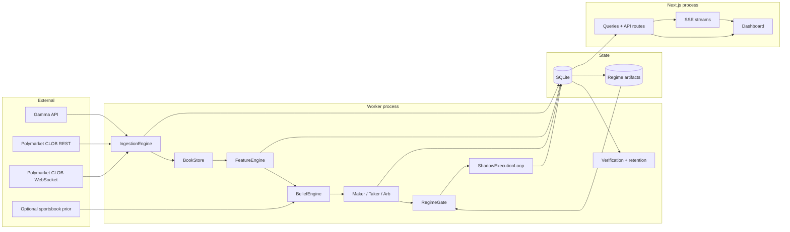
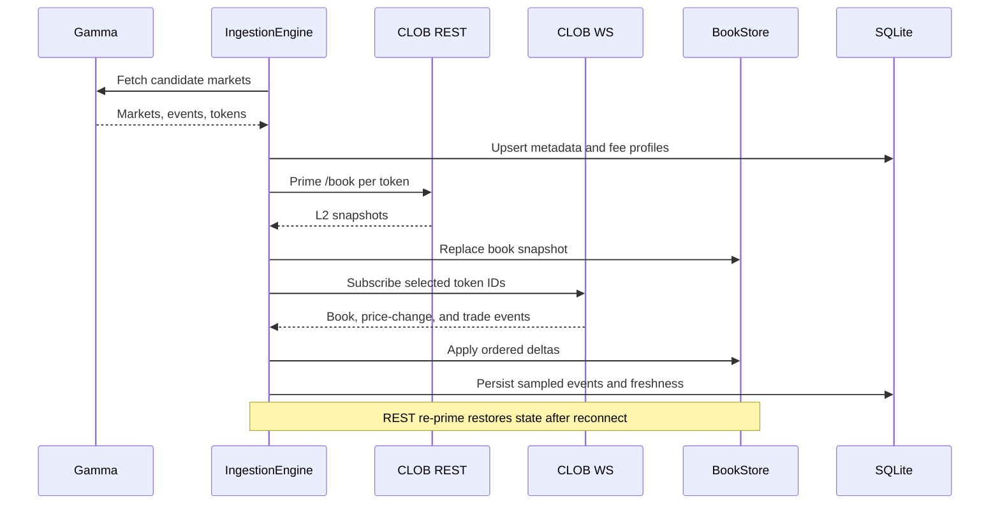
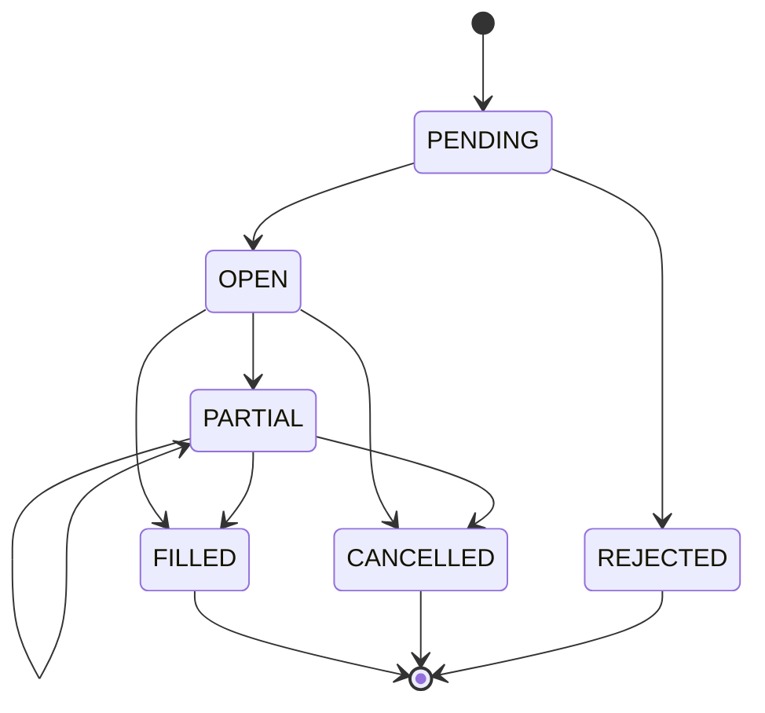
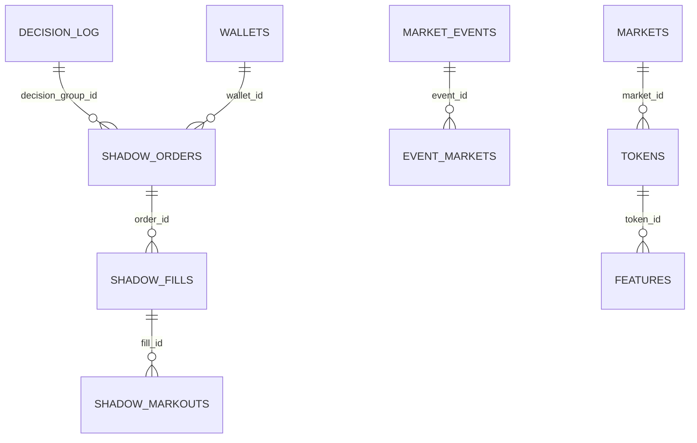

# PolySignal Architecture

This document is the canonical description of the current runtime. It follows the decision-only hard cutover: legacy signal tables are not part of the trading path.

## 1. System purpose and safety boundary

PolySignal is an evidence-first Polymarket microstructure research system. It turns public market data into fee-aware maker, taker, and structural-arbitrage decisions, simulates execution, measures subsequent markouts, and exposes the evidence through a web dashboard.

The checked-in worker is deliberately paper-only:

- `loadConfig()` fixes `executionPolicy.mode` to `PAPER`.
- `liveExecution.enabled` is fixed to `false`.
- CLOB execution adapters remain in the tree, but current configuration cannot route orders to them.
- Every attempted strategy action is evaluated through persisted shadow orders, fills, and markouts.

Changing this boundary is a security- and capital-sensitive architecture change, not a configuration tweak.

## 2. Architectural invariants

The system is organized around six invariants:

1. **One decision, one identity.** Each decision has one canonical `decision_log.id`.
2. **Composable evidence.** Decisions compose to orders, fills, and markouts through stable IDs; no stage infers identity from timestamps.
3. **Costs precede action.** A lane may act only on edge after the canonical fee and cost model.
4. **Monotonic execution state.** Terminal order states never regress, and cumulative fill accounting is conserved.
5. **Deterministic local transforms.** Book, feature, cost, gate, and replay calculations are explicit functions of persisted or timestamped inputs.
6. **Paper-first promotion.** Live capability cannot be inferred from positive backtests; promotion requires realistic shadow evidence and hard gates.

In compositional form, the main pipeline is:

```text
Market event -> Book state -> Feature vector -> Belief -> Decision
             -> Shadow order -> Fill -> Markout -> Promotion evidence
```

Each arrow has a contract. The end-to-end claim is valid only when every intermediate contract holds.

## 3. System context



The worker and web processes must resolve the same `DB_PATH`. Generated data and reports are runtime state and are intentionally excluded from Git.

## 4. Repository boundaries

| Area | Responsibility | Primary entry points |
| --- | --- | --- |
| `apps/worker` | Runtime orchestration, ingestion, decisions, shadow execution, verification | `src/main.ts` |
| `apps/web` | Dashboard, read models, API routes, SSE | `app/`, `lib/queries.ts` |
| `packages/book` | In-memory L2 book state and delta application | `src/index.ts` |
| `packages/data` | Gamma/CLOB clients and regime analysis | `src/` |
| `packages/features` | Rolling deterministic microstructure features | `src/featureEngine.ts` |
| `packages/storage` | SQLite/Drizzle schema, migrations, retention | `src/schema.ts`, `migrations/` |
| `packages/types` | Shared data contracts | `src/` |
| `packages/utils` | Shared deterministic helpers | `src/` |
| `configs` | Checked-in strategy, verification, and UI configuration | `worker.json`, `verification.json` |
| `scripts` | Gates, replay, diagnostics, migrations, and evidence generation | `scripts/` |

## 5. Ingestion and book state

`IngestionEngine` periodically discovers active markets through Gamma, classifies each market profile, persists market/token metadata, fetches fee metadata, primes each selected book through CLOB REST, and subscribes to CLOB WebSocket updates.



Book validity requires prices in `[0,1]` and `bestBid <= bestAsk`. Invalid books do not produce feature rows.

## 6. Feature state

Once per configured interval, the worker maps each valid book window to a `FeatureRow`. The feature function is conceptually:

```text
F : BookWindow -> (mid, spread, OBI, microprice, returns,
                  acceleration, skew, entropy, volatility, depth, staleness)
```

The worker writes both append-only history in `features` and the latest token projection in `latest_features`. Historical rows support replay and markouts; the latest projection keeps UI and lane queries bounded.

Feature correctness depends on event order, explicit timestamps, and fixed rolling windows. Hidden wall-clock dependencies break replay equivalence and are prohibited.

## 7. Belief composition

Belief providers return a probability `p_i` and confidence `c_i`. With configured provider weight `w_i`, the blend uses:

```text
a_i     = max(0, w_i * c_i)
p_hat   = sum(a_i * p_i) / sum(a_i)
conf    = sum(a_i * c_i) / sum(a_i)
```

Probabilities and confidence are clamped to `[0,1]`. A provider failure removes that provider from the composition; if no valid prior remains or aggregate confidence is below the configured minimum, the lane receives no belief and records no actionable decision.

The default microstructure provider transforms mid, order-book imbalance, volatility, and spread into a bounded prior. The sportsbook provider is optional.

## 8. Canonical decision and cost model

All lanes use `apps/worker/src/trading/DecisionEngine.ts` and `CostModel.ts`.

For a taker BUY:

```text
predictedEdgeBps = (p_hat - ask) / mid * 10,000
```

For a taker SELL:

```text
predictedEdgeBps = (bid - p_hat) / mid * 10,000
```

The canonical net edge is:

```text
netEdgeBps = predictedEdgeBps - totalCostBps
```

The executable ask/bid already includes entry spread. `spreadBps` is attribution only, not another deduction. A cash fee is normalized on the positive midpoint reference notional `sizeShares × midPx`; a modeled BUY share fee is valued at the same prediction target as gross edge before normalization. Every cost term and the final edge use that same denominator. Inventory penalty is a policy term, not posted cash. The fully specified contract and supported scope are in [math assurance](math_assurance.md).

For fee-enabled profiles, the rounded taker fee is based on:

```text
rawFeeUSDC = shares * feeRate * price * (1 - price)
```

The current documented scenario uses five-decimal fee units. `PolymarketFeeMath.ts` performs decimal-string arithmetic and pins a version label. Historical as-of pricing requires an explicitly bounded schedule; the current documentation is not evidence of a historical effective date. The dashboard still contains a fee-equivalent estimate that is not an authoritative fill ledger.

Maker quote edge includes the quote-to-mid spread exactly once. Fill-dependent edge, costs and rebates are weighted by fill probability; standing liquidity rewards and submission/inventory policy terms are separate. Liquidity order score uses the dimensionless `((maxSpreadCents - distanceCents) / maxSpreadCents)^2` factor. A raw score is not a payout.

## 9. Strategy lanes

### Maker

The maker loop loads wallets with `maker_enabled=1`, builds two-sided post-only candidates, applies inventory skew and notional limits, evaluates fee/rebate/reward-aware EV, then applies wallet, trade-flow, and regime gates independently to BID and ASK.

### Taker

The taker loop loads wallets with `auto_trade_enabled=1 AND maker_enabled=0`, compares both sides after costs, then applies wallet-side, market-filter, toxicity, adaptive-side, inventory, close-policy, and regime gates.

### Structural arbitrage

The arb scanner evaluates binary YES/NO parity and negRisk basket inequalities. Opportunities and multi-leg executions share a `decision_group_id`. Batch size is capped by the CLOB order limit. Only gross-matched fee-free BUY complete sets can currently be submitted as arb. Fee-charged BUY baskets lack verified net-share matching; SELL baskets lack proven inventory/collateral, so both fail closed instead of being labeled completed arbitrage.

## 10. Wallet and regime gates

Wallet filtering is a pure predicate over a structured `market_filter_json`. Invalid filters fail closed for only the affected wallet. See `wallet_strategy_filters.md`.

The regime layer maps a feature vector to a discrete Markov state, then looks up evidence by `(state, kind, wallet)`. It can block, explore, or scale a candidate. Regime direction never replaces `p_hat`; it modulates a decision already produced by a lane.

Regime reports are generated outside the main worker event loop and atomically published through a manifest plus last-good fallback. The checked-in configuration deliberately uses fail-open exploration because execution is hard-wired to paper. Any future live-execution design must change this boundary to fail closed before capital can be routed.

## 11. Shadow execution and lifecycle



Fill size is cumulative. Filled-price accounting uses VWAP, and late events cannot rewrite terminal states. Maker shadow fills are derived from observable trade/book evidence; taker shadow fills occur at the crossed quote. Synthetic maker fills are disabled in the current worker configuration.

Each fill schedules markouts at fixed horizons. Directional markout is:

```text
BUY:  (futureMid - fillPrice) / fillPrice * 10,000
SELL: (fillPrice - futureMid) / fillPrice * 10,000
```

Markout measures price movement after fill. Net profitability must separately include fees and execution costs; the UI and gates must not silently conflate the two.

## 12. Evidence schema



Core ownership:

- `decision_log`: why a lane acted or skipped, including predicted edge and gate diagnostics.
- `shadow_orders`: intended execution, lane, side, price, size, lifecycle, and decision group.
- `shadow_fills`: cumulative execution evidence and fill method.
- `shadow_markouts`: horizon outcome for a specific fill.
- `experiment_runs`: hypothesis, parameters, context fingerprint, results, and verdict.

The hard-cutover migration drops `signals`, `latest_signals`, and `signal_evidence`. New queries must not recreate signal-era joins.

## 13. Concurrency and persistence

The worker is a single Node process with independently scheduled ingestion, feature, maker, taker, arb, shadow-execution, retention, verification, and regime-report loops. SQLite runs in WAL mode. Expensive report generation is moved out of the hot event loop.

Operational rules:

- Bound hot-path queries by recent IDs or time windows.
- Use latest-projection tables for UI reads.
- Defer retention and heavy verification during startup warmup.
- Keep task schedulers non-overlapping.
- Treat active-feed freshness, not dormant-universe age, as liveness.

## 14. Web read model and security

The Next.js app reads SQLite through bounded query helpers and publishes live updates over SSE. Main views cover the market universe, decision chain, wallets, positions, performance, experiment ledger, and regimes.

If `DASHBOARD_USERNAME` and `DASHBOARD_PASSWORD` are set, middleware protects the entire site with HTTP Basic authentication. Without credentials, production reads remain public while mutating API requests fail closed.

The web app and worker are separate processes and share no in-memory state.

## 15. Verification and promotion

The verification stack checks:

- absence of legacy signal schema dependencies;
- decision-chain referential integrity;
- one-row-per-decision projection semantics;
- append-only decision history;
- realistic maker and taker activity;
- runtime freshness and safety settings;
- counterfactual and replay behavior;
- positive realized PnL thresholds for required profiles.

Key commands:

```bash
pnpm go-live:gate
pnpm evidence:pack
pnpm evidence:pack:frozen
pnpm replay:policy
pnpm counterfactual:gate
```

Artifacts are timestamped under `reports/`. A console-only success claim is not promotion evidence.

## 16. Failure behavior

| Failure | Expected behavior |
| --- | --- |
| Gamma unavailable | Keep prior universe where safe; retry with backoff |
| CLOB WS disconnect | Mark feed stale, reconnect, and re-prime through REST |
| Invalid/crossed book | Skip feature production for that token |
| Belief provider fails | Continue with remaining providers or return no belief |
| Unknown market profile | Fail closed for trading |
| Invalid wallet filter | Block only that wallet with `wallet_filter_invalid` |
| Missing regime artifacts | Use configured fail-open/closed policy and last-good snapshot |
| Database invariant fails | Surface verification failure; hard gates return non-zero |
| Worker loop throws | Log the iteration failure; scheduler continues unless startup safety requires exit |
| Live credentials present | No effect while the hard-coded paper-only boundary remains |

## 17. Extension rules

When adding a provider, feature, gate, or strategy:

1. Define its typed input and output contract.
2. State units, sign conventions, timestamps, and identity keys.
3. Compose through the canonical decision and cost boundary.
4. Persist enough input/output evidence to replay the result.
5. Add deterministic unit tests and an invariant for cross-stage correctness.
6. Keep failure behavior explicit and local.
7. Update this document, `agent.md`, and `skills.md` when an architectural boundary changes.

This discipline is what makes the end-to-end profitability claim a composition of auditable steps rather than an opaque result.
